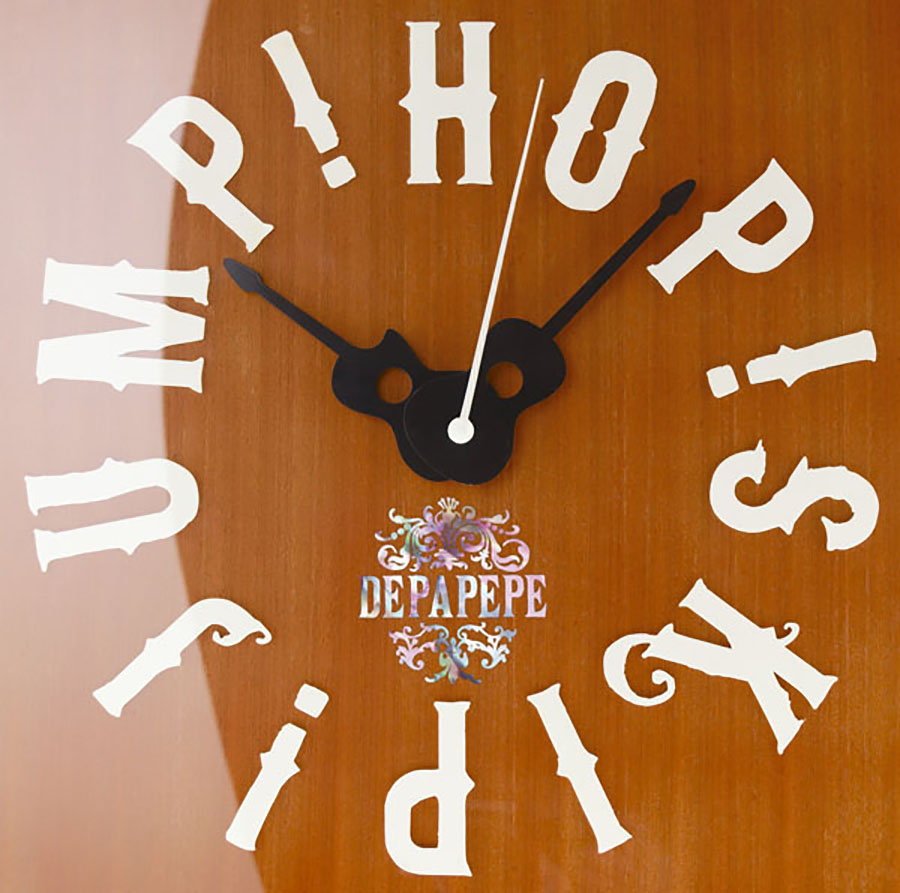
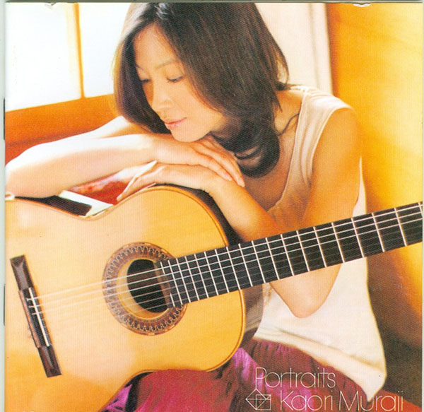
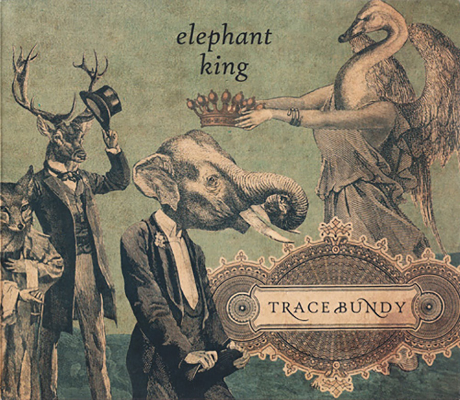
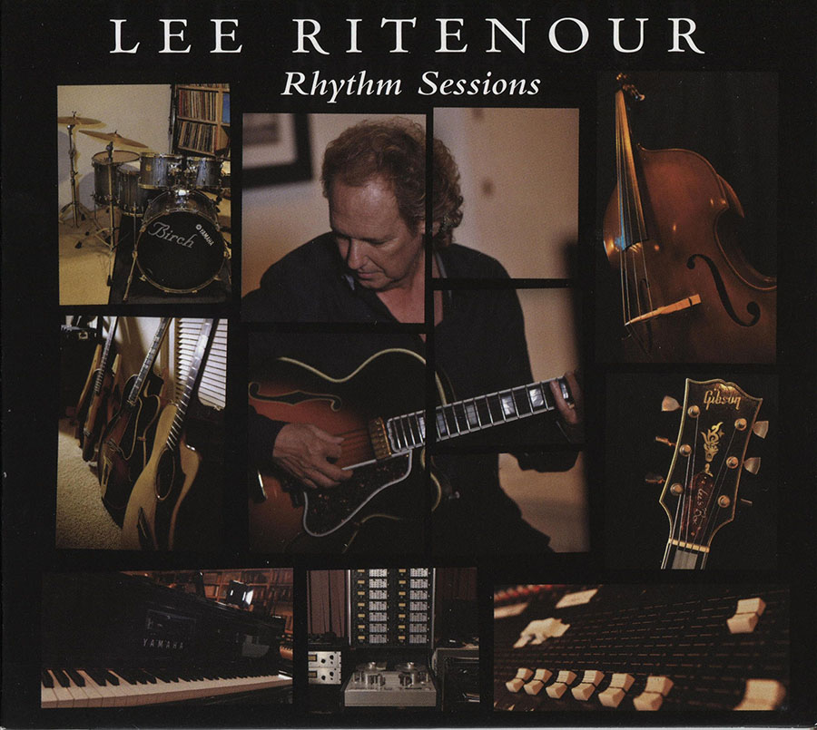
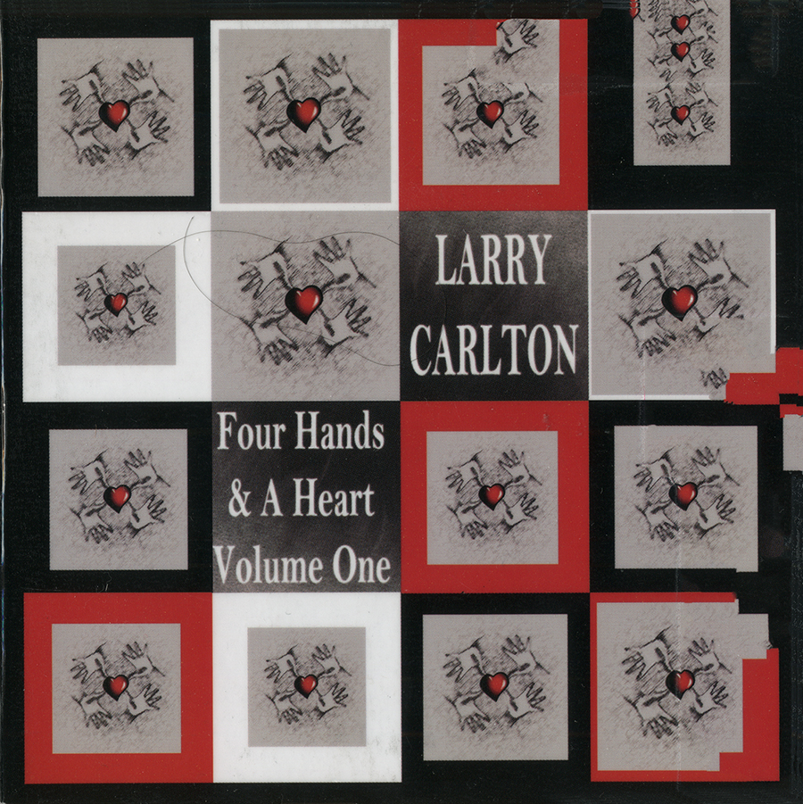
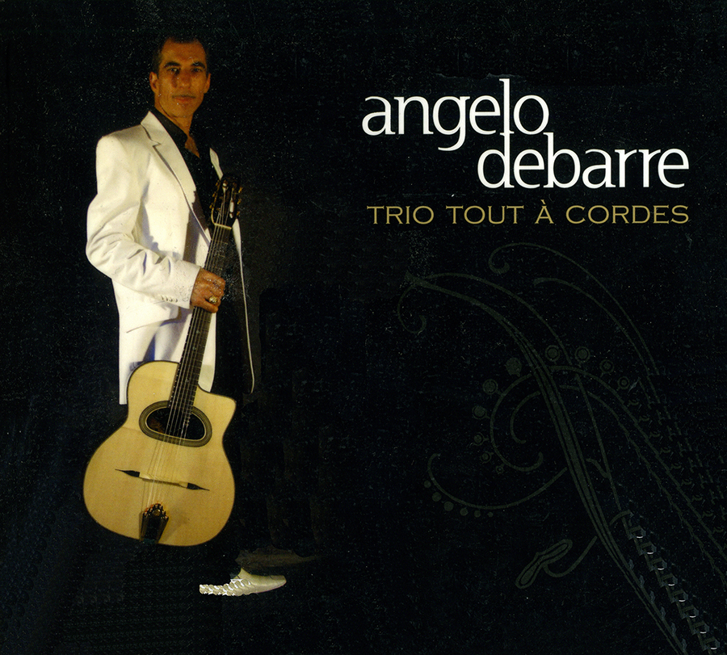
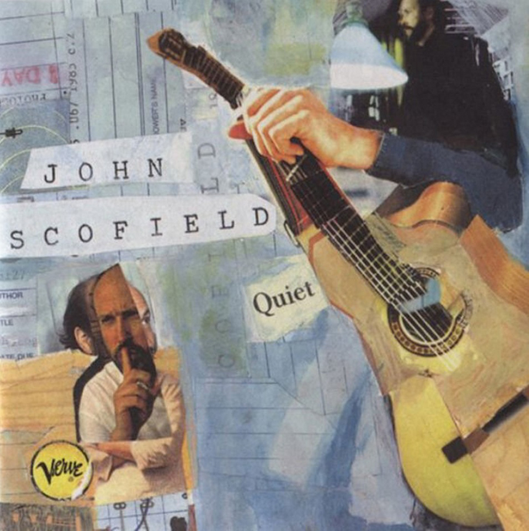
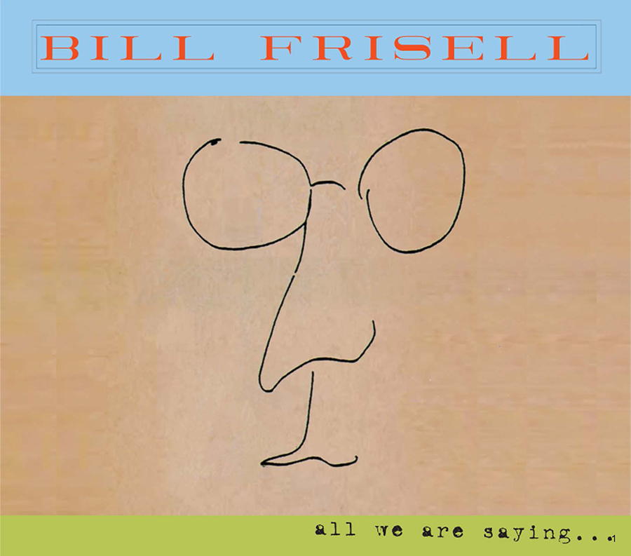

Gin-N-Tonic 2016
=========

> "It is a curious fact, and one to which no-one knows quite how much importance to attach, that something like 85 percent of all known worlds in the Galaxy, be they primitive or highly advanced, have invented a drink called jynnan tonyx, or gee-N'N-T'N-ix, or jinond-o-nicks, or any one of a thousand variations on this phonetic theme.
>The drinks themselves are not the same, and vary between the Sivolvian ‘chinanto/mnigs’ which is ordinary water served just above room temperature, and the Gagrakackan 'tzjin-anthony-ks’ which kills cows at a hundred paces; and in fact the only one common factor between all of them, beyond the fact that their names sound the same, is that they were all invented and named before the worlds concerned made contact with any other worlds."

Douglas Adams, *The Restaurant at the End of the Universe*

## Results
- [mds maps](https://github.com/andkov/gin-n-tonic-2016/blob/master/analysis/basic-mds/figure-png/mds-maps.md)

## Gin resources
- [How to taste gin](http://ginmonger.com/ginmonger_012.htm) by GinMonger
- [Gin taste test](http://www.theguardian.com/lifeandstyle/wordofmouth/2012/oct/19/taste-test-gin) by The Guardian
- History of [gin cocktails](http://www.diffordsguide.com/encyclopedia/2015-12-17/1068/cocktails/history-of-gin-cocktails) by Simon Difford

## Multidimensional Scaling Resources
- [7 functions](http://gastonsanchez.com/blog/how-to/2013/01/23/MDS-in-R.html) to conduct MDS in R    
- [Quick R](http://www.statmethods.net/advstats/mds.html) MDS reference.  
- [R-bloggers](http://www.r-bloggers.com/multidimensional-scaling-mds-with-r/) article on basic MDS.  

## Musical Menu

|   |   |
|---|---|
|*Hop! Skip! Jump!* by  DEPAPEPE   | |
|*Portraits* by Kaori Muraji   |   |
|*Elephant King* by Trace Bundy   |     |
|*Rhythm Sessions* by Lee Ritenour   |     |
|*Four Hands & A Heart* by Larry Carlton   |     |
|*Blues for Raangy* by Angelo Debarre    |     |
|*Quiet* by John Scofield   |     |
|*All We Are Saying* by Bill Frisell   |     |

