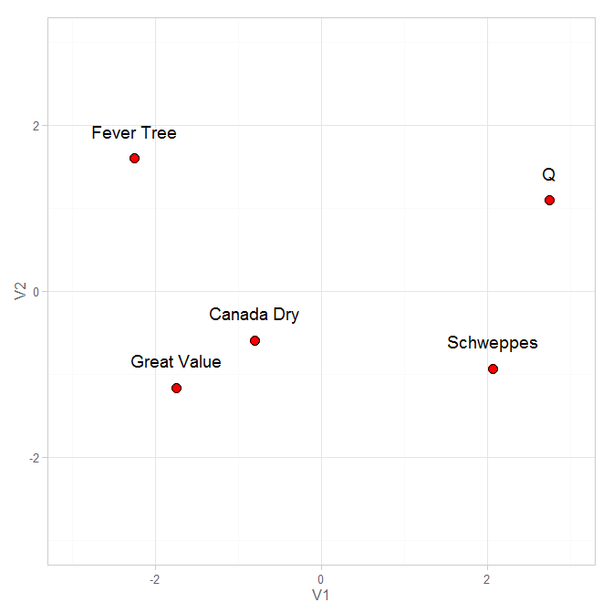

# Gin-n-Tonic 2016

Happy New Year of 2016!

<!--  Set the working directory to the repository's base directory; this assumes the report is nested inside of two directories.-->


<!-- Set the report-wide options, and point to the external code file. -->


<!-- Load the sources.  Suppress the output when loading sources. --> 


<!-- Load 'sourced' R files.  Suppress the output when loading packages. --> 


<!-- Load any global functions and variables declared in the R file.  Suppress the output. --> 


<!-- Declare any global functions specific to a Rmd output.  Suppress the output. --> 


<!-- Load the datasets.   -->


<!-- Tweak the datasets.   -->


 

# Session Information
For the sake of documentation and reproducibility, the current report was rendered on a system using the following software.


```
Report rendered by koval_000 at 2015-12-31, 17:13 -0800
```

```
R version 3.2.2 (2015-08-14)
Platform: x86_64-w64-mingw32/x64 (64-bit)
Running under: Windows 8 x64 (build 9200)

locale:
[1] LC_COLLATE=English_United States.1252  LC_CTYPE=English_United States.1252    LC_MONETARY=English_United States.1252
[4] LC_NUMERIC=C                           LC_TIME=English_United States.1252    

attached base packages:
[1] grid      stats     graphics  grDevices utils     datasets  methods   base     

other attached packages:
[1] magrittr_1.5       RColorBrewer_1.1-2 dichromat_2.0-0    ggplot2_1.0.1      extrafont_0.17     knitr_1.10.5      

loaded via a namespace (and not attached):
 [1] Rcpp_0.11.6         formatR_1.2         plyr_1.8.3          tools_3.2.2         rpart_4.1-10       
 [6] digest_0.6.8        evaluate_0.7        gtable_0.1.2        nlme_3.1-121        lattice_0.20-33    
[11] smacof_1.7-0        mgcv_1.8-7          labdsv_1.7-0        Matrix_1.2-2        DBI_0.3.1          
[16] yaml_2.1.13         parallel_3.2.2      polynom_1.3-8       proto_0.3-10        gridExtra_0.9.1    
[21] Rttf2pt1_1.3.3      stringr_1.0.0       dplyr_0.4.1         cluster_2.0.3       nnet_7.3-10        
[26] ade4_1.7-3          ecodist_1.2.9       survival_2.38-2     rgl_0.95.1435       foreign_0.8-65     
[31] rmarkdown_0.7       latticeExtra_0.6-26 Formula_1.2-1       reshape2_1.4.1      extrafontdb_1.0    
[36] nnls_1.4            splines_3.2.2       Hmisc_3.16-0        scales_0.2.5        htmltools_0.2.6    
[41] MASS_7.3-44         assertthat_0.1      ape_3.4             permute_0.8-4       colorspace_1.2-6   
[46] labeling_0.3        stringi_0.4-1       acepack_1.3-3.3     munsell_0.4.2       vegan_2.3-2        
```
